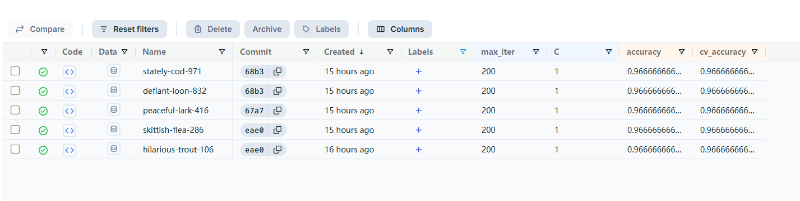
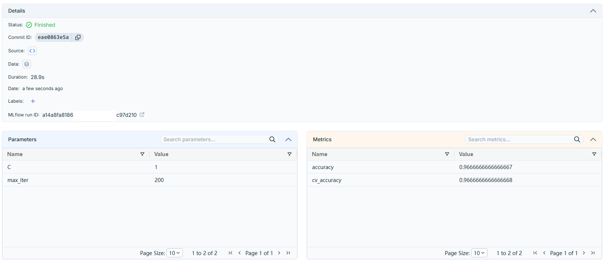

# Iris ML/MLOps Pipeline

End-to-end machine learning pipeline for Iris classification with experiment tracking, model evaluation, quality gates, model registry, and CI automation.

## Project Overview

The project trains a Logistic Regression classifier on the Iris dataset and automates the following workflow:

1. Train several models with different `C` values.
2. Select the best model using cross-validation accuracy.
3. Evaluate the model on a test set.
4. Apply a quality gate (`accuracy >= 0.95`).
5. Log experiments, metrics, parameters, and model artifacts to MLflow.
6. Register successful models in the MLflow Model Registry.
7. Maintain a `champion` model alias based on CV accuracy.
8. Run tests and the ML pipeline automatically with GitHub Actions.

## Tech Stack

* Python
* Scikit-learn
* MLflow
* DagsHub
* Pytest
* GitHub Actions
* Pandas

## ML Pipeline

The main pipeline is located in `src/pipeline.py`.

The current model is Logistic Regression. Several values of `C` are tested using 5-fold cross-validation.

The best configuration achieved approximately:

* Test Accuracy: **0.9667**
* CV Accuracy: **0.9667**

Models that do not pass the quality gate are not registered.

When a new registered model has a higher CV accuracy than the current `champion`, the `champion` alias is updated. Equal scores do not replace the existing champion.

## Screenshots




## MLflow & DagsHub

MLflow is hosted remotely through DagsHub:

* Experiment tracking
* Model artifacts
* Model Registry
* `champion` model alias

The project originally used a local MLflow server and a `.env` file for local configuration. During the transition to DagsHub, tracking was moved to the remote MLflow server. The local MLflow server and `.env` configuration were subsequently removed.

GitHub Actions accesses the DagsHub MLflow instance using GitHub Secrets.

## GitHub Actions

The workflow in `.github/workflows/tests.yml`:

* installs dependencies
* runs the evaluation tests
* runs the ML pipeline
* connects to the remote MLflow instance
* registers successful models

This provides automated testing and model pipeline execution on repository changes.

## Project Structure

```text
end-to-end-ml-pipeline/
├── .github/
│   └── workflows/
│       └── tests.yml
├── src/
│   ├── train.py
│   ├── evaluate.py
│   ├── register.py
│   └── pipeline.py
├── tests/
│   └── test_evaluate.py
├── requirements.txt
├── README.md
└── .gitignore
```

## Purpose

This project is primarily an educational MLOps project demonstrating how a basic machine learning workflow can be extended with experiment tracking, model versioning, quality gates, model promotion, and CI automation.


## Author Erick